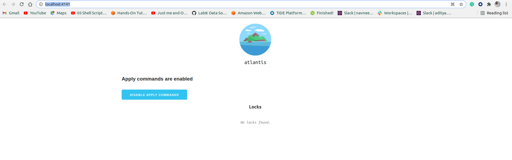

# Atlantis testing locally setup

## Prerequisite
- Terraform 
- github account

**Note: terraform needs to be in the $PATH for Atlantis.**

## Download atlantis binary 
- https://github.com/runatlantis/atlantis/releases/download/v0.17.0/atlantis_linux_amd64.zip
- extract it and copy it inside `/usr/local/bin`

## Download ngrok
- https://bin.equinox.io/c/4VmDzA7iaHb/ngrok-stable-linux-amd64.zip

## extract it and open the teminal apply this command
```
 ./ngrok http 4141
```
## Set some environment variables
- `export URL="https://localhost.ngrok.io"`
- `export SECRET="{YOUR_RANDOM_STRING}"`

## Now Configure  a webhook inside your github repository
- Go to your repo's settings
- Select Webhooks or Hooks in the sidebar
- Click Add webhook
- set Payload URL to your ngrok url with /events at the end. Ex. https://localhost.ngrok.io/events
- double-check you added /events to the end of your URL.
- set Content type to application/json
- set Secret to your random string
- select Let me select individual events
- check the boxes
- Pull request reviews
- Pushes
- Issue comments
- Pull requests
- leave Active checked
- click Add webhook

## Set some more environment variables
- `export TOKEN="{your_generated_webhook_token}"`
- `export USERNAME="{the username of your GitHub, GitLab or Bitbucket user}"`
- `export REPO_ALLOWLIST="$YOUR_GIT_HOST/$YOUR_USERNAME/$YOUR_REPO" `
    - for eg: "github.com/himanshuDevopsGuy/terraform-github-actions"

## Start Atlantis Command
```
atlantis server \
--atlantis-url="$URL" \
--gh-user="$USERNAME" \
--gh-token="$TOKEN" \
--gh-webhook-secret="$SECRET" \
--repo-allowlist="$REPO_ALLOWLIST"
```

## Open your browser and type  the URL there

Example:  http://localhost:4141/

